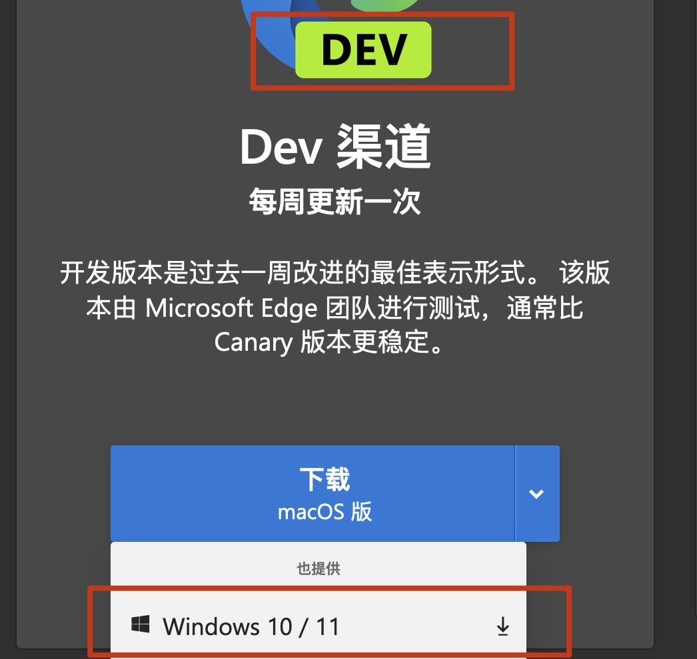
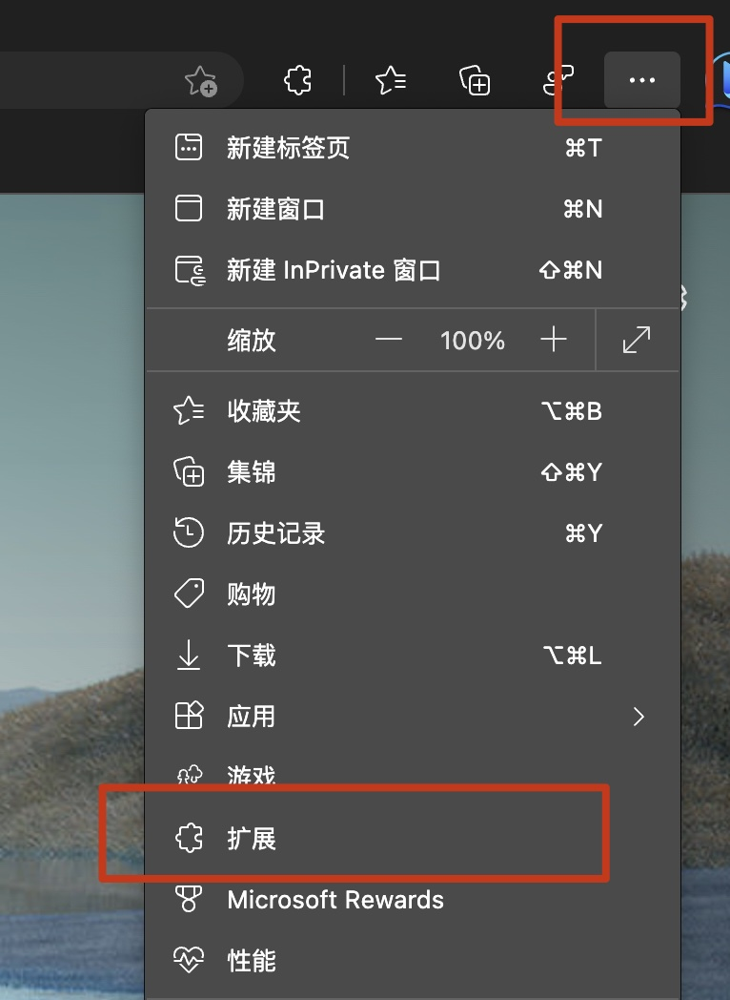
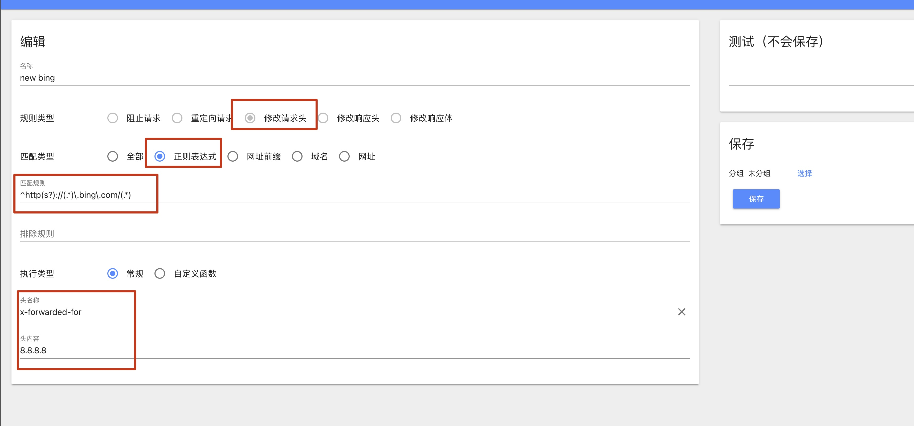
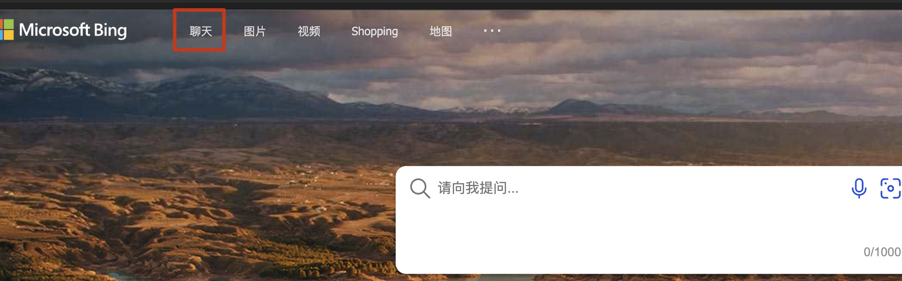

1. [点击这里](https://www.microsoftedgeinsider.com/zh-cn/download)，下载微软的 edge 浏览器 dev 版

    

2. 在 edge 浏览器中访问 `edge://settings/profiles` ，使用微信发的账号登录

3. 依次点击 目录 -> 扩展 -> Header Editor -> 管理 -> 添加（右下角的+号） -> 按照图片中配置 -> 点击保存  

    ```
    ^http(s?)://(.*)\.bing\.com/(.*)
    x-forwarded-for
    8.8.8.8
    ```

      
    

4. 访问 `https://www.bing.com` 点击左上角 `聊天` 这个选项卡  
    

    